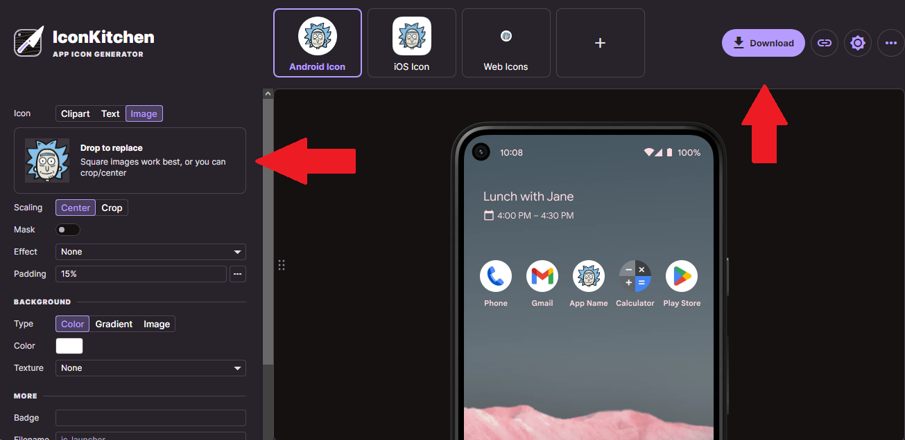
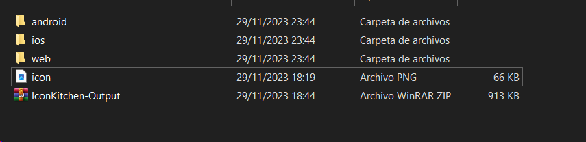
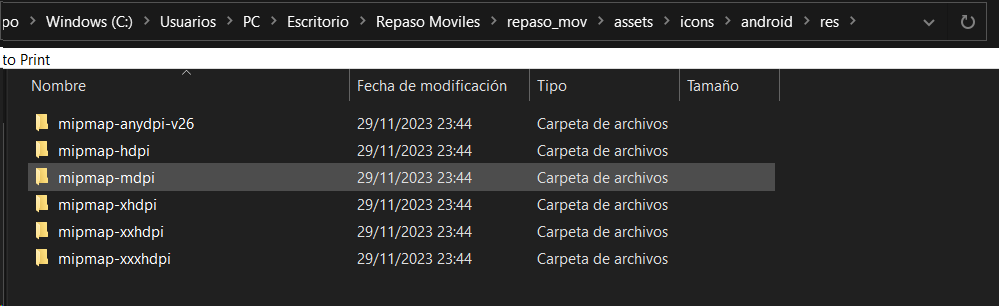
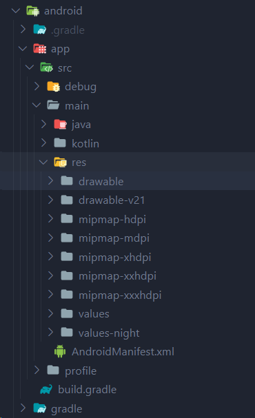
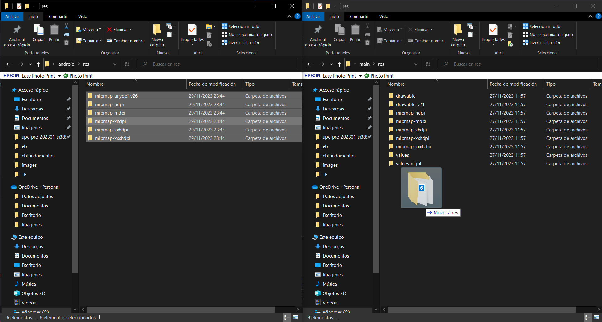

# repaso_mov
# Pasos para realizar el proyecto
1. Al crear tu proyecto limpia tu main.dart quitandole la plantilla que se genera por defecto.
2. Para hacer uso del DDD necesitamos realizar la distribución correcta de carpetas, en caso de este proyecto tenemos la siguiente distribución - El contenido de cada bounded puede variar.
   

  

3. Ahora que tenemos las carpetas creadas, pasamos a importar las dependencias que usaremos, http, path y sqflite, para la correcta realización.
   

  

4. Primero creamos la barra de negación ya que esto nos permitirá trasladarnos de pestaña a pestaña, lo haremos en el bounded de navegación (dentro de app_navigation.dart está más detallado).
   
5. Vamos a la creación del service para poder hacer uso del api, para ello primero tenemos que crear la clase donde almacenaremos los datos que recibiremos del API, esto guiandonos de los datos que nos bota el Api como la imagen a continuación.
   

  

3. Una vez creada la clase deberia quedar algo así (Revisar el archivo)

  

7. Como tambien trabajaremos con almacenamiento local, crearemos la base de datos y el repository 
* Database
  

  

* Repository (Revisar el archivo)
  

  

8. Ahora si pasaremos a crear el service, el cual deberia quedar de la siguiente manera

  

9. Para mostrar la lista de los personajes de rick and morty necesitamos 3 cosas, primero el card donde se mostrará su imagen y su nombre, el contenedor donde estarán todos esos cards y el detalle de estas mismas
10. Primero comenzaremos con el widget de card, despues con la vista details, con estos 2 ya podriamos realizar el home donde se mostraran los personajes principales.
11. Ahora finalizamos esta sección implementando el character container 
12. con todo esto implementado realizamos la pagina de busqueda 
13. Seguimos con la pagina de favoritos y finalizamos con cambiar las referencias en el AppNavigator
14. Para cambiar el icono primero tenemos que ir al siguiente enlace https://icon.kitchen.
15. Una vez aquí cargas la imagen y seleccionas el fondo que prefieras, luego le das download

  

16. Al descomprimir el archivo te dejará 3 carpetas - android - ios -web (como esta es una aplicación para android, nos enfocaremos en ella)

  

17. Abrimos la carpeta Android->res y nos encontraremos con varias carpetas, estas son las capetas que usa android para los iconos en distintos tamaños.
    

  

18. En nuestro proyecto ubicamos la carpeta android->app->src->main->res, como podemos ver hay carpetas con el mismo nombre que en el archivo descargado, ahora solo queda copiar las carpetas que descargamos y reemplazarlas.

  

  

19. Y ya tendriamos nuestra aplicación con otro icono